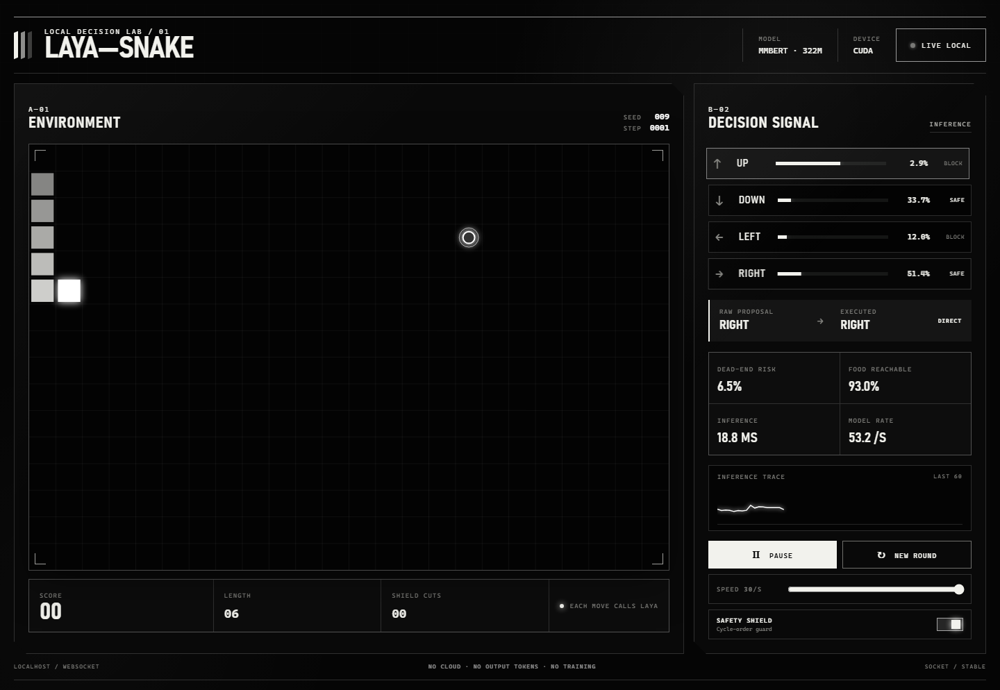

# Laya Snake CUDA

A local, real-time Snake decision demo powered by the upstream Laya typed-decision model on
NVIDIA CUDA. Every move performs a fresh model inference. No Snake training or cloud API is used.



The deterministic planner supplies compact spatial features. Laya returns probabilities for all
four directions plus two model estimates. By default, a Hamiltonian-cycle safety shield prevents
an unsafe proposal from being executed; `--unassisted` exposes the raw policy.

## What is shown

- Live Snake board, score, length, and step count
- Laya probabilities for `UP`, `DOWN`, `LEFT`, and `RIGHT`
- Raw model choice versus executed action
- Visible safety-shield interventions
- Dead-end-risk and food-reachability model answers
- Measured inference latency, decision rate, device, and token count
- Optional offline JSONL recording

## Local model layout

The CLI searches `models/` for a checkpoint and never downloads during play:

```text
models/
└── laya-upstream/
    └── multilingual/
        ├── model.safetensors
        ├── rl_agent_config.json
        ├── encoder/
        │   └── config.json
        └── tokenizer/
            ├── tokenizer.json
            └── tokenizer_config.json
```

## Setup

Requirements: Windows, an NVIDIA GPU with a current driver, and `uv`.

```powershell
uv sync --extra dev
uv run hf download convaiinnovations/laya `
  --include "multilingual/*" `
  --local-dir models/laya-upstream
```

## Run

```powershell
# Recommended: local web dashboard with a real browser GUI
uv run laya-snake-web

# Terminal dashboard at 8 decisions per second
uv run laya-snake

# Run as fast as inference allows
uv run laya-snake --max-speed

# Execute raw top-1 Laya choices without the safety shield
uv run laya-snake --unassisted

# Reproducible finite benchmark with an append-only decision record
uv run laya-snake --headless --max-speed --steps 600 `
  --record artifacts/run-seed-7.jsonl
```

Controls: `Space` pauses, `Up/Down` or `+/-` changes speed, `R` resets with the next seed, and
`Q` exits. A terminal around 105 columns wide shows the board and metrics side by side; narrower
terminals automatically stack the panels. The first inference is a warm-up and is normally slower.

The web dashboard runs entirely on `http://127.0.0.1:8765`. The Python backend keeps the local
Laya checkpoint resident on CUDA and pushes each completed decision to the browser over a local
WebSocket. The page includes pause/resume, new round, speed, and safety-shield controls; it does
not upload game state or model data.

## Verify

```powershell
uv run pytest -q
uv run ruff check .
uv run python -c "import torch; print(torch.cuda.get_device_name()); print(torch.cuda.is_available())"
```

The model outputs are not calibrated Snake death probabilities. The planner provides explicit
spatial facts; this project demonstrates local typed decisions and safe execution, not unaided
visual board reasoning or reinforcement learning.
